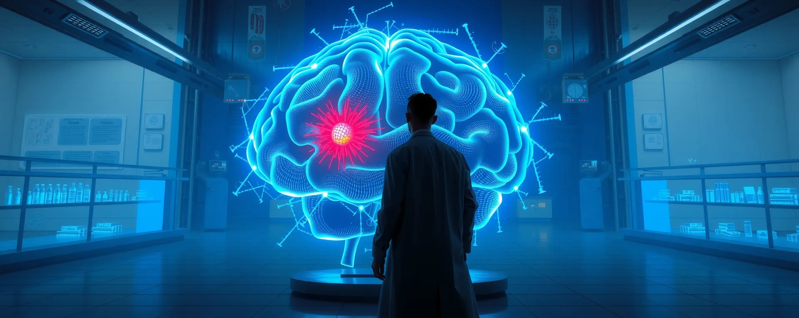
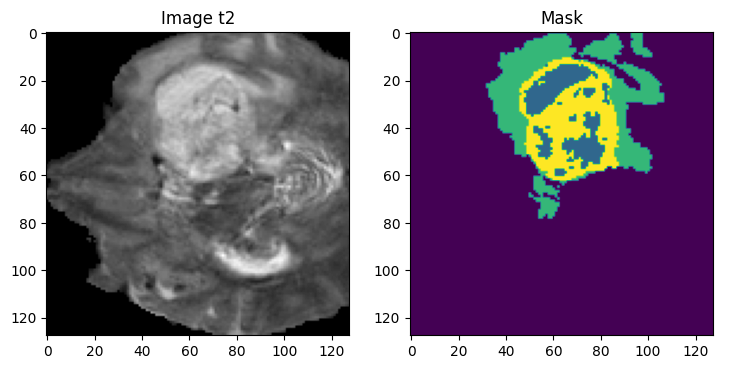
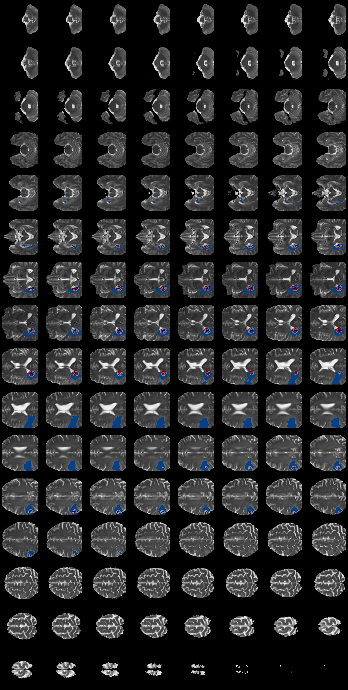

# Multiclass Brain Tumor Segmentation from 3D MRI



## Table of Contents
- [Project Overview](#project-overview)
- [Data](#data)
- [Model Architecture](#model-architecture)
- [Parameters](#parameters)
- [Performance](#performance)
- [MRI Data Augmentation](#mri-data-augmentation)
- [Visualizations](#visualizations)
- [Getting Started](#getting-started)
- [Contributing](#contributing)
- [License](#license)

## Project Overview

This project focuses on multiclass brain tumor segmentation using 3D MRI T2-weighted images. We employ a 3D-UNet architecture to segment four distinct classes within brain MRI 3D scans, utilizing the BraTS2020 Dataset from Kaggle.
\
\
**Date:** July 2023

## Data

The dataset consists of 3D MRI T2-weighted scans from the [BraTS2020 Dataset](https://www.kaggle.com/datasets/awsaf49/brats20-dataset-training-validation), available on Kaggle. These images are used for multiclass (4 classes) brain tumor segmentation.



*Figure 1: Sample MRI slices showing different tumor classes*

## Model Architecture

We utilize a 3D-UNet model architecture for multiclass segmentation. This architecture is particularly well-suited for 3D medical imaging data as it can effectively capture and utilize spatial information in all three dimensions.


*Figure 2: [3D-UNet model architecture](https://d3i71xaburhd42.cloudfront.net/ae4e7e2274b0d018867e7715c6747c7296aa0c10/3-Figure1-1.png)*

### Why 3D-UNet?

1. **Spatial Information**: 3D-UNet is designed to process volumetric data, making it ideal for 3D MRI scans. It preserves and utilizes spatial information in all three dimensions, which is crucial for accurate tumor segmentation.

2. **Skip Connections**: The architecture includes skip connections that combine low-level and high-level features, allowing for more precise localization of tumors.

3. **Depth**: The model's depth allows it to learn hierarchical features, from simple edges to complex tumor patterns.

4. **Efficiency**: Despite working with 3D data, the model is relatively efficient due to its U-shaped structure and the use of max-pooling operations.

## Parameters

- **Data size**: 200 patients
- **Training:**
  - Original data: 200 epochs
  - Augmented data: 120 epochs
- **Batch size**: 4
- **Dropout**: 0.2
- **BatchNormalization**: Applied
- **Activation function**: ReLU
- **Kernel initializer**: He uniform
- **Optimizer**: Adam (learning_rate=0.001)

## Performance

Our model achieved the following performance metrics:

- **Mean IoU (Intersection over Union)**: 0.6277199
- **Accuracy**: 0.984017014503479

## MRI Data Augmentation

To improve model generalization and performance, we applied the following data augmentation techniques:

1. Horizontal Flip
2. Elastic Deformation
3. Contrast and Brightness Adjustment


*Figure 5: MRI Data Augmentation*

## Visualizations

To better understand the 3D nature of our data and results, we provide various visualization techniques:

### 1. 3D Visualization


*Figure 6: 3D visualizations of segmented tumor*

### 2. GIF Animation


*Figure 7: Animated GIFs showing MRI slices*

### 3. 2D Montage



*Figure 8: 2D montage of key MRI slices*

## Getting Started

To use this project, follow these steps:

1. Clone the repository:
   ```
   git clone https://github.com/ASBK-exe/Multiclass-Brain-Tumor-Segmentation-3D-MRI.git
   ```

2. Follow the provided notebook

**Note:** The trained model is provided too, feel free to experiment!

## Contributing

We welcome contributions to improve this project. Please feel free to submit issues, feature requests, or pull requests.

## License

This project is licensed under the MIT License - see the [LICENSE](LICENSE) file for details.